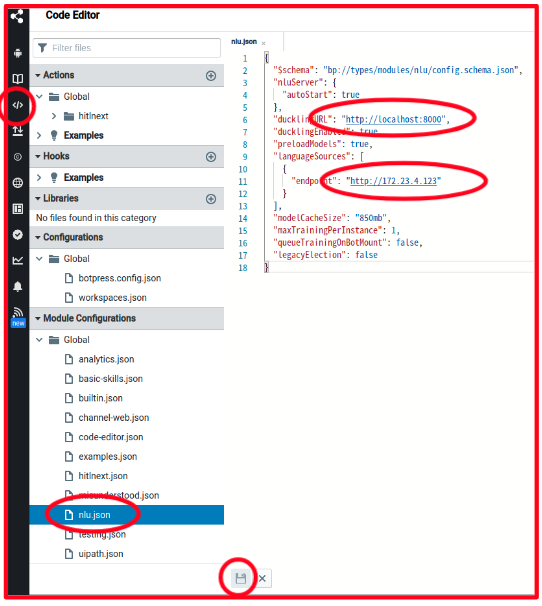
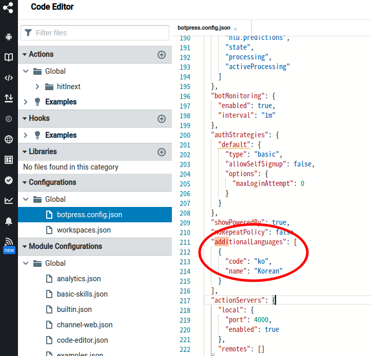
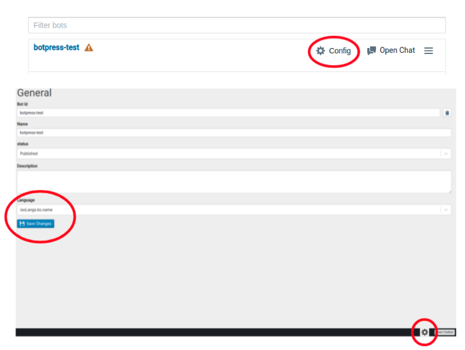

# install-chatbot
*** 사용 가이드는 guide 디렉토리 참고

## About Botpress
* Opensource Chatbot platform
* intent(의도) 인식, 스펠링 검사, entity(개체) 추출, 슬롯 태깅과 같은 NLP task 내장
* workflow 설계를 위한 스튜디오 제공
* 대화를 시뮬레이션하고 챗봇을 디버깅하는 emulator, debugger 제공
* Slack과 같은 메시징 채널 지원
* 기능 확장을 위한 SDK & code editor 지원   
* 분석 dashboard 등 배포 후 도구(post-deployment tool) 지원


## Install Steps
1. [Botpress server 배포](https://github.com/tmax-cloud/install-chatbot#step-1-botpress-server-%EB%B0%B0%ED%8F%AC)
2. [Custom language server 배포](https://github.com/tmax-cloud/install-chatbot#step-2-custom-language-server-%EB%B0%B0%ED%8F%AC)
3. [Language server 연동을 통한 nlu 적용](https://github.com/tmax-cloud/install-chatbot#step-3-language-server-%EC%97%B0%EB%8F%99%EC%9D%84-%ED%86%B5%ED%95%9C-nlu-%EC%A0%81%EC%9A%A9)

## Step 1. Botpress server 배포
* 목적 : `Botpress server를 설치한다.`
* 생성 순서 
    * [1.botpress.yaml](./1.botpress.yaml) 환경 변수 수정
        * 1.botpress.yaml 파일의 ingress 리소스의 {CUSTOM_DOMAIN_NAME} 부분을 해당 환경에 맞는 ingress 접근 주소로 수정한다.
    * [1.botpress.yaml](./1.botpress.yaml) 배포 `ex) kubectl apply -f 1.botpress.yaml`
    * 아래 명령어를 수행하여 botpress server pod가 정상적인지 확인한다.
        ```bash
        $ kubectl get pod -n chatbot
        ```
    * Botpress stuido에 접속 확인 후 계정 생성
        * `kubectl get ingress -n chatbot` 명령어로 확인된 ingress HOSTS 주소를 통하여 studio에 접속한다.      
* 비고 : 
    * 서비스는 NodePort 타입, 스토리지 클래스는 default storage class로 적용되어 있음, 필요시 해당 환경에 따라 수정
    * 인그레스를 사용하지 않는 환경에서는 ingress 리소스를 생성하지 않고 nodeport로 생성된 서비스의 포트번호를 확인하여 접속한다.

## Step 2. Custom language server 배포
* 목적 : `한국어 nlu 적용을 위해 관련 bin, model 파일이 포함된 커스텀 랭귀지 서버를 설치한다.`
* 생성 순서 
    * [2.custom-language-server.yaml](./2.custom-language-server.yaml) 배포 `ex) kubectl apply -f 2.custom-language-server.yaml`
    * 아래 명령어를 수행하여 custom language server pod가 정상상태인지 체크하고 해당 서비스 IP를 확인한다.
        ```bash
        $ kubectl get pod -n chatbot
        $ kubectl get svc -n chatbot
        ```

## Step 3. Language server 연동을 통한 nlu 적용
* 목적 : `몇가지 설정을 통해 앞서 배포한 봇프레스 서버와 랭귀지 서버를 연동한다.`
* 생성 순서 
    * 봇프레스 서버 ui 화면에서 code-editor 버튼을 클릭한 후 nlu.json 파일을 수정한다.
        * ducklingURL -> http://localhost:8000
        * languageSources.endpoint -> 앞의 단계에서 확인한 랭귀지 서버 서비스의 ip 
    * 봇프레스 서버 ui 화면에서 code-editor 버튼을 클릭한 후 botpress.config.json 파일을 수정한다.   
        * additionalLanguages -> code: ko, name: Korean       
    * 생성한 봇의 config 화면에서 Language 부분을 isoLangs.ko.name으로 변경 후 저장
        * 화면 하단의 restart server 버튼이 뜬다면 클릭하여 서버를 reboot한다.
         
    
      

