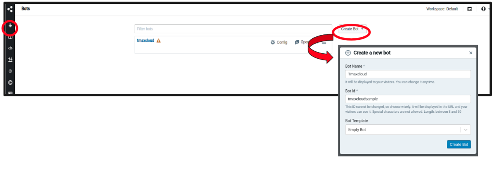
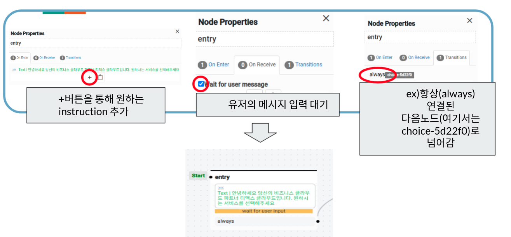
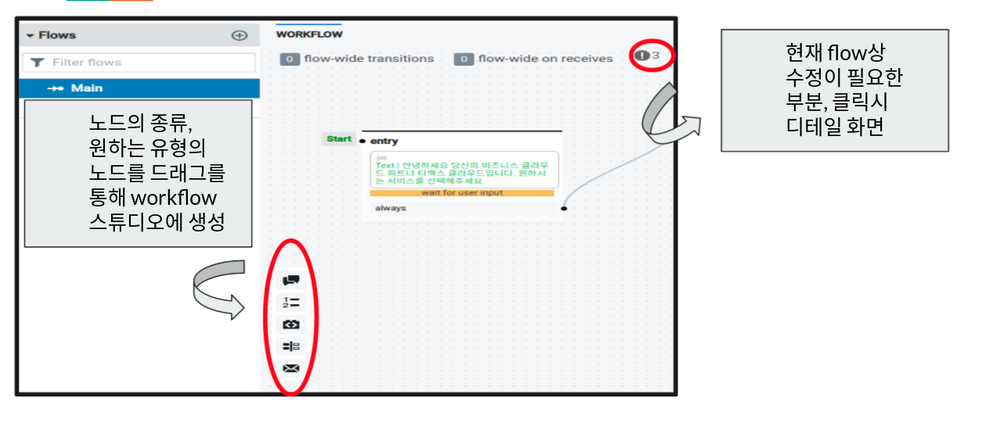
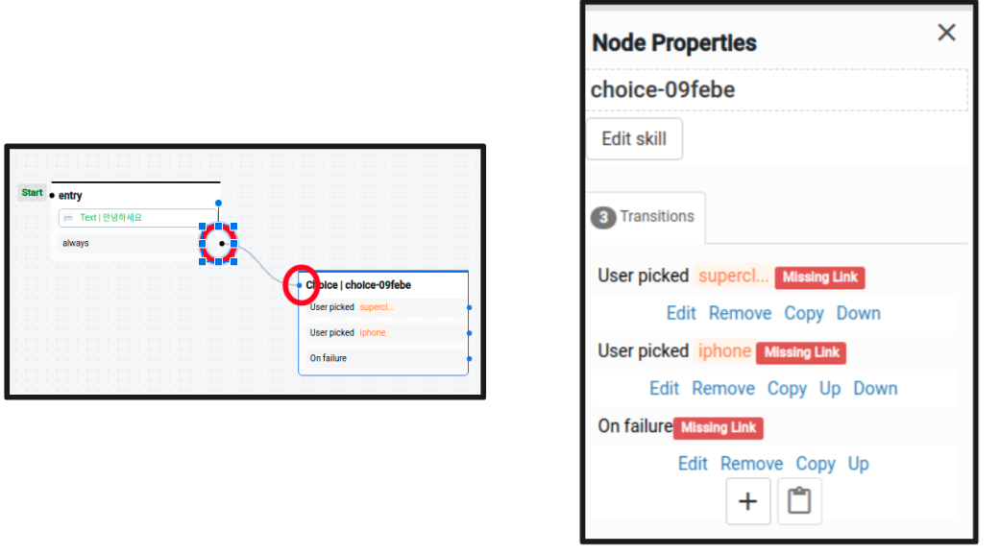
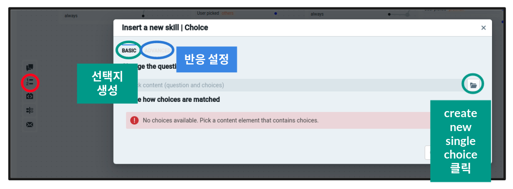
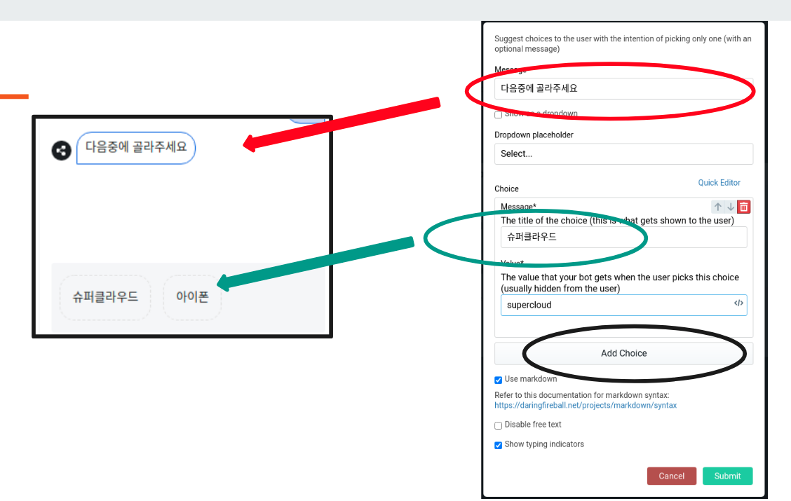
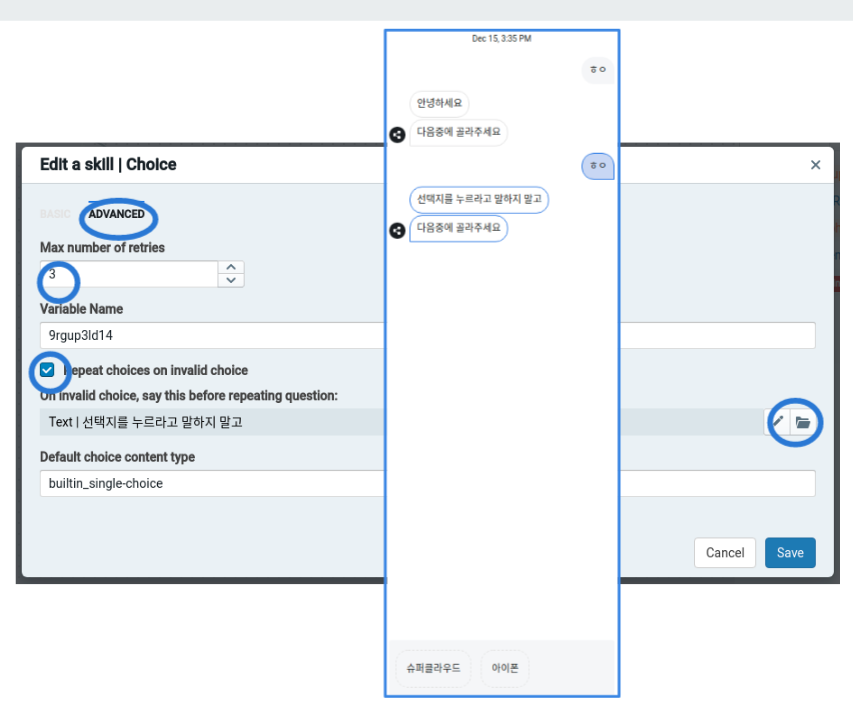
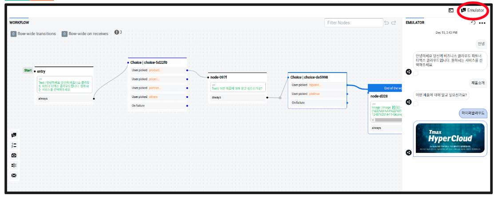
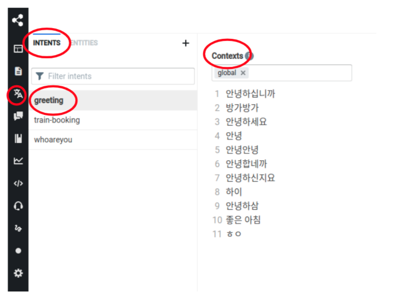
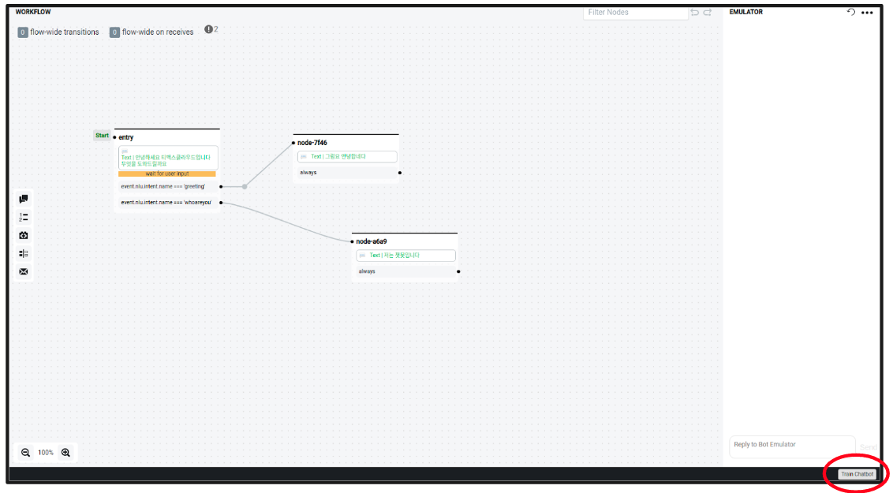

# Botpress를 통한 chatbot 활용 가이드

## steps
1. [Bot 생성](https://github.com/tmax-cloud/install-chatbot/tree/main/guide#step-1-bot-%EC%83%9D%EC%84%B1)
2. [About node&workflow](https://github.com/tmax-cloud/install-chatbot/tree/main/guide#step-2-about-nodeworkflow)
3. [Workflow 설계](https://github.com/tmax-cloud/install-chatbot/tree/main/guide#step-3-workflow-%EC%84%A4%EA%B3%84)
4. [Choice](https://github.com/tmax-cloud/install-chatbot/tree/main/guide#step-4-choice)
5. [Emulator](https://github.com/tmax-cloud/install-chatbot/tree/main/guide#step-5-emulator)
6. [NLU](https://github.com/tmax-cloud/install-chatbot/tree/main/guide#step-6-nlu)

## Step 1. Bot 생성
* 목적 : `Bot을 생성한다.`
* 생성 순서 
    * 좌측 상단의 Bots 메뉴 접속 후 Create Bot 을 통해 bot을 생성한다.
    * Bot Name(수정 가능)과 Bot Id(수정 불가, url에 표시), 그리고 Bot Template을 설정후 새로운 봇을 생성한다.
         

## Step 2. About node&workflow
* 목적 : `node와 workflow에 관한 기본 사항을 학습한다.`
* 노드는 챗봇 대화 logic의 기본단위로 다음 세가지 stage를 가진다.
    * on enter -> 노드에 들어올때 실행되는 instruction
    * on receive -> 해당 노드가 active 상태일 때, 유저에게 메시지 수신시 실행되는 instruction
    * transition -> on enter나 on receive 조건이 모두 실행된 후 다음 단계로 이동하기위한 조건과 조건이 충족되면 실행할 액션
     

## Step 3. Workflow 설계
* 목적 : `생성한 봇에 노드들을 추가하여 workflow를 생성한다.`
* 생성 순서 
    * 대화 플로우를 설계하고 필요한 노드들을 추가한다.
        a. 기본 노드
        b. choice
        c. api call
        d. slot filling
        e. send email
    * 생성한 노드들을 설정한 transition 조건에 따라 드래그를 통해 연결해준다.
    * 노드의 수정 필요시 원하는 노드를 선택후 우측 node properties 메뉴에서 수정한다.
* 비고 : 
    * 생성한 workflow는 설치시 생성한 볼륨의 /bots/bot-name/flows에 저장된다.
    * 밑의 단계에서 노드중 하나인 choice 노드 사용법을 가이드 하였다.
     
     

## Step 4. Choice
* 목적 : `choice 노드의 사용법`
* 생성 순서 
    * choice 노드를 생성하고 원하는 선택지와, 유효하지 않은 액션을 하는 유저에 대한 반응을 설정한다.
         
    * 선택지가 나올때 표출할 대화와, 유저에게 보여질 메시지, bot이 가져갈 value를 설정한다.
    * Add choice 버튼을 통해 필요한 선택지들을 추가한다.
    
    * 유저가 선택지 선택 이외에 다른 액션을 취하는 경우의 반응을 설정한다.
        a. 최대 retry 수
        b. 선택지 화면 반복 여부
        c. 유저의 invalid action시 표기할 메시지  
        

## Step 5. Emulator
* 목적 : `emulator를 통해 지금까지 설계한 workflow의 시뮬레이션을 돌려본다.`
    * 우측 상단의 Emulator 버튼을 이용하면 지금까지 설계한 워크플로우의 시뮬레이션을 돌려볼 수 있다.
     

## Step 6. NLU
* 목적 : `NLU에 관한 사항을 학습하고 간단한 Intent 분류 예시를 가이드한다.`
* NLU TASK
    * Intent Classification(의도 분류)
        a. 발화자의 intent(의도)를 분류한다
        b. ex) ‘서울에서 강릉가는 기차 예매해줘’ -> intent는 기차예매
    * Entity Extraction(개체 추출)    
        a. 발화에서 entity를 추출한다.
        b. 알려진 entity(시간, 서수, 날짜 등) 및 custom entity를 설정할수 있다.
        c. ex)  ‘서울에서 강릉가는 기차 예매해줘’ -> entity는 서울, 강릉
    *  Slot Tagging(슬롯 태깅)   
        a. intent를 위한 슬롯을 정의한다.
        b. ex) 기차예매를 위해서 출발지와 도착지 슬롯을 정의
    *  서울에서 강릉가는 기차 예매해줘’라는 사용자의 발화를 듣고 기차예매라는 intent를 분류하고 출발지와 도착지라는 두가지 슬롯을 채우기 위해 서울과 강릉이라는 entity를 추출하여 봇은 서울에서 강릉가는 기차를 예매할 수 있게 된다.   
* 생성 순서 
    * 생성한 봇에 접속해 NLU 버튼을 클릭하고 INTENT + 를 통해 원하는 인텐트를 생성한다.
    * 그리고 학습에 필요한 컨텍스트를 추가한다(최소 10개)
    * 예시에서는 greeting(인사)라는 인텐트 분류를 위해 인사말 11개를 작성하였다.
         
    * 우측 하단의 Train Chatbot 버튼을 통해 생성한 인텐트를 학습시킨다.
    * 봇의 flow 화면에서 노드의 transition 조건을 intent is로 설정하고 원하는 인텐트를 지정한다.
    * 사용자의 발화가 해당 인텐트로 분류될시 설정한 다음 노드로 넘어갈수 있게 플로우를 생성한다. 
    * emulator를 통해 성능을 확인한다.
    
    
* 비고 : 
    *  intent name과 같은 몇몇 부분에서 한글 사용이 제한되어 있으니 영어로 정의하고 내부 context만 한글로 작성한다.

## 참고 : pdf 가이드 파일
[chatbot_user_guide.pdf](./chatbot_user_guide.pdf)     